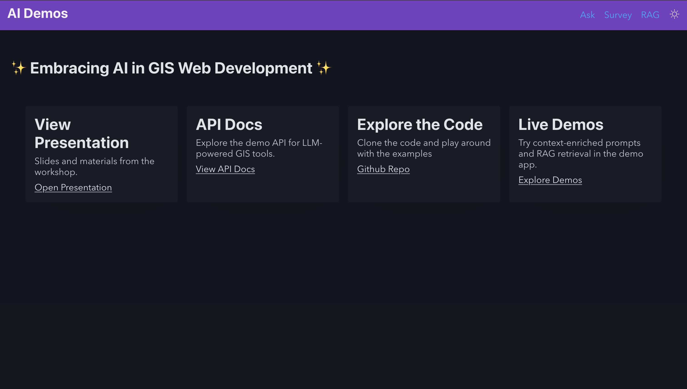
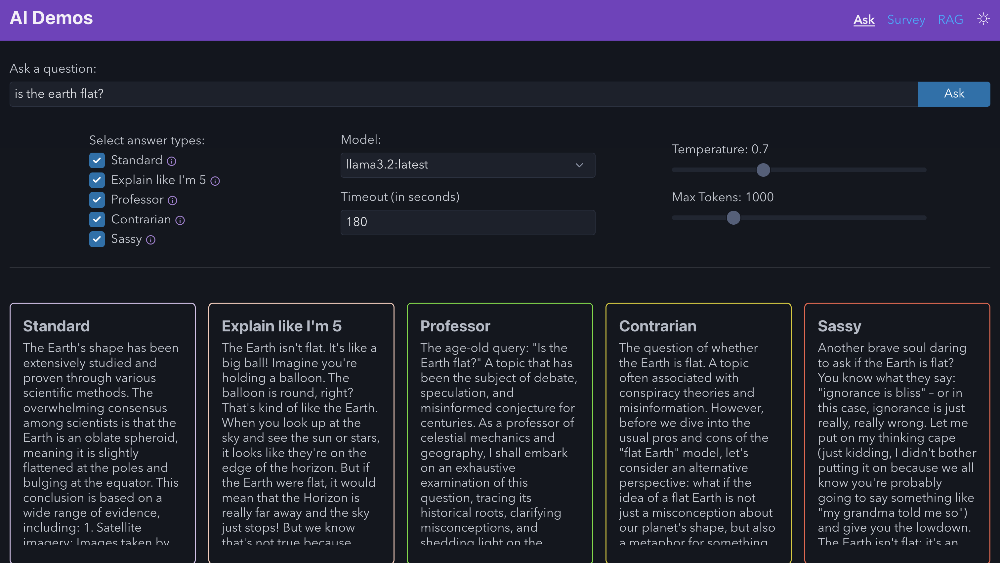
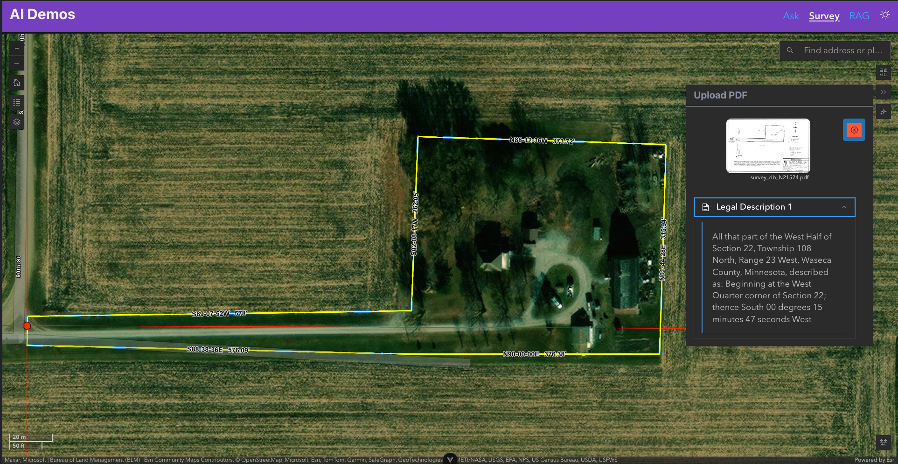
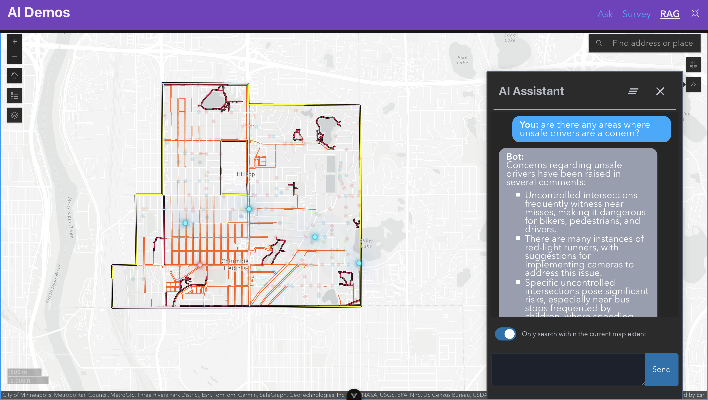

# Resistance is Futile: Embracing AI in GIS Web Development

This repo contains the [presentation](./presentation/) and [demo materials](./demo-app/) for the `Embracing AI in GIS Web Development` workshop at the [2025 MN GIS/LIS Annual Conference](https://www.mngislis.org/mpage/annualconference) in Duluth, MN October 1-3, 2025.

### Abstract

> Worried AI might take your job? Don’t panic — it’s way more fun to let it help with your job instead. In this hands-on workshop, we’ll explore how AI assistants like ChatGPT and GitHub Copilot can supercharge your workflow, from writing cleaner code faster to automating tedious tasks.
> 
> But code isn’t the whole story — we’ll also dive into how large language models can help make sense of data. You’ll learn how to use LLMs to summarize large volumes of text, extract structured and unstructured information, and even build smarter tools using vector databases and retrieval-augmented generation (RAG). Whether you’re wrangling GIS datasets, building apps, or just trying to stay ahead of the AI curve, this session will give you practical skills and real examples you can start using right away.


### Lecture Slides

The live link to the lecture slides can be found at:

[https://bolton-and-menk-gis.github.io/gislis-2025-ai-workshop/](https://bolton-and-menk-gis.github.io/gislis-2025-ai-workshop/1)

## Demo Setup

The [demo-app](./demo-app/) features a Full Stack example complete with an API for working with Large Language Models (LLM) to enhance your web applications. The backend is a Python [FastAPI](https://fastapi.tiangolo.com/) application and the frontend uses [Vue.js](https://vuejs.org/) and [picocss](https://picocss.com/).

### Python Environment Setup (with Conda)

1. **Create a new Python 3.11 environment:**

    ```sh
    conda create -n gis-ai-demo python=3.11
    ```

2. **Activate the environment:**
    ```sh
    conda activate gis-ai-demo
    ```
3. **Install dependencies from `requirements.txt`**
    ```sh
    cd demo-app/backend
    pip install -r requirements.txt
    ```

### LLM Setup

This demo application makes use of calling Large Language Models (LLMs) and in order to be most effective, it is recommended to use a highly capable model such as [OpenAI's Chat GPT 4]() (requires an API Key) or Open Source Options such as [llama3](https://ollama.com/library/llama3)

#### Ollama Download (Optional)

To use locally hosted open source models, you can download [Ollama](https://ollama.com/)

[Windows Installer](https://ollama.com/download/windows)

[Mac Installer](https://ollama.com/download/mac)

#### OpenAI API Key setup (optional)


1. **Sign up or log in to OpenAI:**
   - Go to [https://platform.openai.com/](https://platform.openai.com/) and create an account or log in.

2. **Create an API key:**
   - Navigate to your [API Keys page](https://platform.openai.com/api-keys).
   - Click "Create new secret key" and copy the generated key.

3. **Set your API key in your environment:**
   - Add the following line to your `.env` file in `demo-app/backend`:
     ```
     OPENAI_API_KEY=your-key-here
     ```
   - Or set it as an environment variable before running your app:
     ```sh
     export OPENAI_API_KEY=your-key-here
     ```

> **Note:** The free tier has very limited usage. For a smoother experience, consider adding a few dollars of credit to your OpenAI account. You can add funds [here](https://platform.openai.com/account/billing). Even a small amount such as $5 will go a long way.

### `.env` file setup

Inside the `demo-app/backend/app` folder, we need to ensure an `.env` file is set. This is typically not tracked in the git repository to avoid leaking sensitive information. However, there is a [.env.example](./demo-app/backend/app/.env.example) that can be saved as `.env` and then populated with the following variables:

```env
OPENAI_API_KEY=<your-api-key>
OLLAMA_URL=http://localhost:11434
```

### RAG Prep

In order to set up the data for the RAG demo, please run the following script:

```sh
# ensure we are in the correct folder
cd demo-app/backend
python -m app.data.preload
```

## Frontend setup

To set up the frontend app, you must first install the dependencies. In a new terminal, enter the following commands:

```sh
cd demo-app/frontend
npm install && npm run build
```

The frontend can be ran in `dev` mode or as self-hosted in the `FastAPI` application hosted in the `demo-app/backend/static` folder. Both methods are outlined below:

### Run in `dev` mode:

```sh
# demo-app/frontend
npm run dev
```

> the app should be running locally at (port can vary):
>  [http://localhost:5173/app](http://localhost:5173) 

## Run the application

```sh
# demo-app/backend
uvicorn app.main:app --port 8000 --reload
```

The API documentation ([SwaggerUI]()) should be available at:

[http://localhost:8000/docs](http://localhost:8000/docs)

### Self-Hosted Frontend

Now that the python application is running and we have [built](#frontend-setup) the frontend, the self-hosted frontend app can be found at:

[http://localhost:8000/app](http://localhost:8000/app)



#### Demos

[prompt demo](http://localhost:8000/app/ask)




[survey demo](http://localhost:8000/app/survey)



[RAG demo](http://localhost:8000/app/rag)




### Backend tests

```sh
pytest -q --tb=short
```
