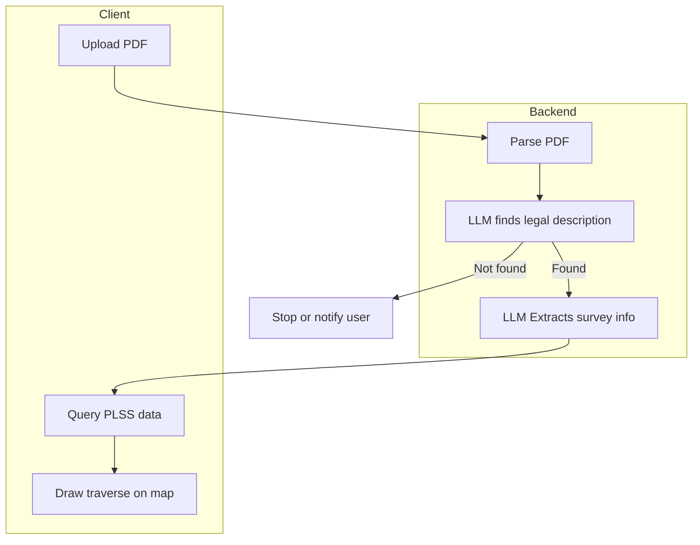

# Creating AI-Driven Solutions

---

## Why use AI in your applications?

<div v-click>

**To Help to Make sense of Data**
- Summarization of long text  
- Q&A from documents  
- Extracting structured fields (e.g., JSON, tables)  
- convert unstructured data into structured data
- Natural language → SQL  
</div>

<div v-click>

**Challenges**

- How to provide the most accurate information to your users?
  - Prevent LLM Hallucination by making your AI features *smarter*
  - Provide your own ground truth data to the LLM
</div>

---

# How to Improve Outputs from LLMs?

LLMs will often hallucinate and can only give information based on what they were trained on. But what can we do to extract better outputs?

* Use better **prompts**

* *Fine Tuning*

* *Retrieval-Augmented Generation (RAG)*


---
text-align: center
---
# ✍️ Prompt Engineering

---

# What is Prompt Engineering?

- Crafting inputs to LLMs to get better outputs  
- Affects **accuracy**, **reliability**, and **usefulness**  
- More than wording — it’s about **clarity & constraints**  

💡 Think of prompts as your "API contract" with the model

---

# Common Techniques

- Be **specific** → avoid vague questions  
- Give **context** → domain info, examples, constraints  
- Ask for **format** → JSON, bullets, tables  
- Iterate → refine your prompt based on results  

---

# Calling LLMs in your Applications

```py
#!usr/bin/env python3
from openai import OpenAI

client = OpenAI()

response = client.chat.completions.create(
    model="gpt-4o",  # Or another suitable model
    messages=[
        {"role": "system", "content": "You are a helpful assistant."}, # <- your prompt
        {"role": "user", "content": "Explain the concept of prompt engineering."}
    ]
)

print(response.choices[0].message.content)
```

In the example above, the prompt `"You are a helpful assistant"` is what tells the LLM to do when it receives any user messages.
---

# Example: Vague vs Improved Prompt

````md magic-move
```
// ❌ Vague prompt (too vague)
Write something about Minneapolis
```

```
// ⚠️ Better, but still too broad
Tell me about Minneapolis geography
```

```
// ✅ Improved prompt
You are a helpful GIS assistant.  
Summarize 3 key facts about Minneapolis related to geography and population.  
Return in bullet points, 1–2 sentences each.
```
````
---

# Advanced Prompt Techniques

- **Role prompting**  
  *"You are a GIS analyst helping city planners…"*
- **Chain-of-thought style** (show reasoning steps)  
  *"Explain step by step how you arrived at the result…"*
- **Create Rules for the LLM to Follow**
  * Provide rules on how certain data should be interpreted
- **Few-shot examples**  
  Provide examples of input → output to guide style
- **Output constraints**  
  Ask for JSON, tables, or specific schema

---

# Example: Structured Output

````md magic-move
```
// ⚠️ Basic prompt
List some neighborhoods in Minneapolis
```
```
// ✅ Structured prompt
You are a GIS assistant.  
List 5 neighborhoods in Minneapolis.  
Return as JSON with fields: { "name": string, "population": int }
```
````

---

# Adding *Context Enrichment*

* LLMs don’t know your private data

* You can inject external context into the prompt

  * Docs, PDFs, or database records

  * Summaries, examples, reference tables
  
  * Can be done on behalf of the user from the *client* or *server* side

* This gives the model the “grounding” it needs

💡 This is the bridge to RAG

---

# Example: With Enriched Context

````md magic-move
```
// ⚠️ Without context
What zoning districts allow multi-family housing in Minneapolis?
```

```
// ✅ With context enrichment
You are a planning assistant.  
Use the following zoning code table:  

R1 = Single Family  
R2 = Duplex  
R3 = Multi-Family  
C1 = Commercial  

Question: What zoning districts allow multi-family housing in Minneapolis?  
Answer in 2–3 bullet points.
```
````

---
layout: cover
---

# Survey Drawing Demo

---
class: center
---
## Survey Drawing Flow



---

###  Prompt: Extract Legal description

````md magic-move
```md
You are a cadastral document assistant. 
Your task is to find the legal land description(s) in a document. 
The text has been split into numbered paragraphs.
```

```md
You are a cadastral document assistant. 
Your task is to find the legal land description(s) in a document. 
The text has been split into numbered paragraphs.

This text often begins with phrases like:
- "That part of the ..."
- "Commencing at ..."
- "Beginning at ..."
- "Legal Description:"
- or includes references to a Section, Township, and Range.
- or is under a "PROPOSED DESCRIPTION" header
```

```md
You are a cadastral document assistant. 
Your task is to find the legal land description(s) in a document. 
The text has been split into numbered paragraphs.

This text often begins with phrases like:
- "That part of the ..."
- "Commencing at ..."
- "Beginning at ..."
- "Legal Description:"
- or includes references to a Section, Township, and Range.
- or is under a "PROPOSED DESCRIPTION" header

### Rules
- Return JSON only.
- If a clear legal description is found, set `"legalDescription"` to the exact text and provide
  a confidence score between 0.0 and 1.0.
- If the model is not confident or no legal description exists, set `"legalDescription": null`
  and `"confidence": 0.0`.
- If you find one or more paragraphs that are legal land descriptions,
  include their indices and the extracted text.
- Exclude unrelated content such as owner names, parcel IDs, surveyor notes, or easements unless
  they are explicitly included within the legal description block.
```

```md
You are a cadastral document assistant. 
Your task is to find the legal land description(s) in a document. 
The text has been split into numbered paragraphs.

This text often begins with phrases like:
- "That part of the ..."
- "Commencing at ..."
- "Beginning at ..."
- "Legal Description:"
- or includes references to a Section, Township, and Range.
- or is under a "PROPOSED DESCRIPTION" header

### Rules
- Return JSON only.
- If a clear legal description is found, set `"legalDescription"` to the exact text and provide
  a confidence score between 0.0 and 1.0.
- If the model is not confident or no legal description exists, set `"legalDescription": null`
  and `"confidence": 0.0`.
- If you find one or more paragraphs that are legal land descriptions,
  include their indices and the extracted text.
- Exclude unrelated content such as owner names, parcel IDs, surveyor notes, or easements unless
  they are explicitly included within the legal description block.

### Output Schema
{{
  "legalDescriptions": [
    {{ 
      index: <int>,
      text: "<string>",
      "confidence": <float between 0.0 and 1.0>
    }}
}}

{paragraphs}
```
````

---

## Send to LLM with Context

````md magic-move
```py
async def extract_legal_description(paragraphs: str, model="gpt-4o-mini"):
    """Extract the legal description from the text."""
    prompt = load_prompt_template('extractLegalDescription')
    messages = [
        {"role": "system", "content": prompt},
    ]
    result = await run_chat_completion(messages, model=model, temperature=0)
    return LegalDescriptionInfo(**result.response)
```

```py
async def extract_legal_description(paragraphs: str, model="gpt-4o-mini"):
    """Extract the legal description from the text."""
    prompt = load_prompt_template('extractLegalDescription', paragraphs=paragraphs)
    messages = [
        {"role": "system", "content": prompt},
    ]
    result = await run_chat_completion(messages, model=model, temperature=0)
    return LegalDescriptionInfo(**result.response)
```
````

---

### Prompt: Parse Legal Description into SurveyInfo

````md magic-move
```md
You are a cadastral/GIS assistant. 
Extract survey information from a legal description
```

```md
You are a cadastral/GIS assistant. 
Extract survey information from a legal description and return JSON only, following this schema:

{{
    "section": <int>,
    "township": <int>,
    "townshipDirection": "N"|"S"|null,
    "range": <int>,
    "rangeDirection": "E"|"W"|null,
    "quarterQuarter": "<two-letter code or null>",
    "referencePoint": {{
        "corner": "<string phrase from description>",
        "divisionLevel": "section"|"quarter"|"forty",
        "tieLine": {{
            "bearing": "<Ndd-mm-ssE|...>",
            "distance": <float>
        }},
        "referenceWhere": "<SQL WHERE clause to query anchor polygons>"
    }},
    "traverse": [{{"bearing": "<...>", "distance": <float>}}, ...],
    "area": "<string or null>",
    "whereClause": "<SQL WHERE clause to query the containing polygon>"
}}
```

```md
You are a cadastral/GIS assistant. 
Extract survey information from a legal description and return JSON only, following this schema:

{{
    "section": <int>,
    "township": <int>,
    "townshipDirection": "N"|"S"|null,
    "range": <int>,
    "rangeDirection": "E"|"W"|null,
    "quarterQuarter": "<two-letter code or null>",
    "referencePoint": {{
        "corner": "<string phrase from description>",
        "divisionLevel": "section"|"quarter"|"forty",
        "tieLine": {{
            "bearing": "<Ndd-mm-ssE|...>",
            "distance": <float>
        }},
        "referenceWhere": "<SQL WHERE clause to query anchor polygons>"
    }},
    "traverse": [{{"bearing": "<...>", "distance": <float>}}, ...],
    "area": "<string or null>",
    "whereClause": "<SQL WHERE clause to query the containing polygon>"
}}

### PLSS Field Mapping
- Section → `FRSTDIVNO`  
- Township → `TWNSHPNO`  
- Range → `RANGENO` (zero-padded to 3 digits, e.g. `'023'`)  
- Quarter → `QSEC`  
- Forty (quarter–quarter) → `QQSEC` 
```

```md
You are a cadastral/GIS assistant. 
Extract survey information from a legal description and return JSON only, following this schema:

{{
    "section": <int>,
    "township": <int>,
    "townshipDirection": "N"|"S"|null,
    "range": <int>,
    "rangeDirection": "E"|"W"|null,
    "quarterQuarter": "<two-letter code or null>",
    "referencePoint": {{
        "corner": "<string phrase from description>",
        "divisionLevel": "section"|"quarter"|"forty",
        "tieLine": {{
            "bearing": "<Ndd-mm-ssE|...>",
            "distance": <float>
        }},
        "referenceWhere": "<SQL WHERE clause to query anchor polygons>"
    }},
    "traverse": [{{"bearing": "<...>", "distance": <float>}}, ...],
    "area": "<string or null>",
    "whereClause": "<SQL WHERE clause to query the containing polygon>"
}}

### PLSS Field Mapping
- Section → `FRSTDIVNO`  
- Township → `TWNSHPNO`  
- Range → `RANGENO` (zero-padded to 3 digits, e.g. `'023'`)  
- Quarter → `QSEC`  
- Forty (quarter–quarter) → `QQSEC`  

### Lookup Rules for `referenceWhere`
- **Section corner**: one polygon (the section).  
- **Quarter corner**: two polygons. Examples:  
  - *East Quarter Corner* → `QSEC IN ('NE','SE')`  
  - *West Quarter Corner* → `QSEC IN ('NW','SW')`  
  - *North Quarter Corner* → `QSEC IN ('NE','NW')`  
  - *South Quarter Corner* → `QSEC IN ('SE','SW')`  
- **Center of Section**: all four polygons (NE, NW, SE, SW).  
- **Quarter–quarter corner**: one polygon (e.g., `QQSEC = 'NESE'`).  

### Rules
- Use `parcelWhere` for the polygon that contains the final parcel.  
- Use `referenceWhere` for the polygon(s) needed to locate the anchor point, only create query for "QSEC" or "QQSEC" fields.  
- Bearings must be quadrant format (e.g. `Ndd-mm-ssE`).  
- If a course references "on said [line]" (e.g., "on said West line", "on said East line"):
  - Use the exact bearing that was previously defined for that line earlier in the description.
  - If only the cardinal direction is given (e.g., "southerly on said West line"), resolve it to the full bearing of the referenced line, not just "S".
  - Example: If the West line was earlier defined as "S00-15-47W", then "southerly on said West line" must also be "S00-15-47W".
- Distances are feet.  
- Always output valid JSON only.  

---

## Legal Description
{legalDescription}

```
````

---

### Send to LLM for Survey Info Extraction

````md magic-move
```py
async def get_survey_info(legalDescription: str, model="gpt-4o") -> SurveyInfo:
    """Get structured survey information from a legal description using an LLM."""
    prompt = load_prompt_template('parseLegalDescription')
    messages = [
        {"role": "system", "content": prompt},
    ]
    result = await run_chat_completion(messages, model=model, temperature=0)

    # print(json.dumps(result.response, indent=2)) # type: ignore
    return SurveyInfo(**result.response) 
```

```py
async def get_survey_info(legalDescription: str, model="gpt-4o") -> SurveyInfo:
    """Get structured survey information from a legal description using an LLM."""
    prompt = load_prompt_template('parseLegalDescription', legalDescription=legalDescription)
    messages = [
        {"role": "system", "content": prompt},
    ]
    result = await run_chat_completion(messages, model=model, temperature=0)

    # print(json.dumps(result.response, indent=2)) # type: ignore
    return SurveyInfo(**result.response) 
```
````

---

### Example of Extracted Survey Info

```json
{
    "section": 22,
    "township": 108,
    "townshipDirection": "N",
    "range": 23,
    "rangeDirection": "W",
    "quarterQuarter": null,
    "referencePoint": {
        "corner": "West Quarter corner of Section 22",
        "tieLine": {
            "bearing": "S00-15-47W",
            "distance": 29.43
        },
        "divisionLevel": "quarter",
        "referenceWhere": "QSEC IN ('NW','SW')"
    },
    "traverse": [
        {
            "bearing": "S00-15-47W",
            "distance": 29.43
        },
        {
            "bearing": "S88-38-36E",
            "distance": 576.09
        },
        {
            "bearing": "N90-00-00E",
            "distance": 376.38
        },
        {
            "bearing": "N01-44-28E",
            "distance": 315.94
        },
        {
            "bearing": "N88-12-36W",
            "distance": 373.72
        },
        {
            "bearing": "S02-08-17W",
            "distance": 262.05
        },
        {
            "bearing": "S89-07-52W",
            "distance": 578.0
        },
        {
            "bearing": "S00-15-47W",
            "distance": 13.76
        }
    ],
    "area": "3.49 acres",
    "whereClause": "FRSTDIVNO = 22 AND TWNSHPNO = 108 AND RANGENO = '023' AND QQSEC IS NULL"
}
```

---

### Client Side - Draw Survey Info

```ts
// pseudo code (actual code is much longer and available in git repo)
async function drawSurveyFeatures(survey: SurveyInfo) {
  // first query plss to find reference/starting point
  const pt = await getSectionCornerPoint(survey)

  // now that we have start point, build from traverse info
  let [ x, y ] = pt

  // polygon coordinates
  const coords: [number, number][] = [[ x, y]]
  for (const traverse of survey.traverse){
    offset = offsetPoint(x, y, traverse.bearing, traverse.distance)
    x = offset[0]
    y = offset[1]
    // add to list of polygon coordinates
    coords.push([x, y])
  }

  // build polygon
  const polygon = new Polygon({ rings: coords })

  // zoom to polygon
  view.goTo(polygon)
}

```

---


---


---
layout: image
image: /images/noah_heel_click.gif
backgroundSize: contain
---


---
layout: cover
---

# ⚙️ Fine-tuning

---

# What is Fine-tuning?

- Training a base LLM further on **your domain data**  
- Adjusts model weights → custom vocabulary, style, tone  
- Useful when:  
  - You need **consistent style/formatting**  
  - You have **lots of similar examples** (support chats, product docs)  
  - Prompts alone aren’t enough  

❗ Not covered hands-on in this workshop — but good to understand

---

# Example: Prompt vs Fine-tuned

````md magic-move
```
// ⚠️ Prompt only
Summarize this incident report in 2 sentences.
Result: inconsistent tone, varying detail.
```

```
// ✅ Fine-tuned model
[trained on 10k incident reports]  
Result: concise, consistent summaries tailored to your org.
```
````

---

# Data Needed

* Input → Output pairs (instructions + target response)

* Cleaned, representative of real use (avoid boilerplate noise)

* Evaluation set held out for measuring quality

* Typical scale: hundreds → tens of thousands of examples
  
---

# Cost, Risk, & Operations

* Training cost & time vs. team productivity gains
  
* Drift: models can overfit stale patterns → schedule re-trains
  
* Governance: store dataset lineage, consent, PII handling
  
* Monitoring: track style/accuracy regressions with evaluations

---

# Key Takeaways

* Fine-tuning = reliable style + domain alignment

* Needs good data more than huge data

* Still pair with prompts for task setup & RAG for facts

* Start small: prototype with prompts → graduate to fine-tune when consistency is the blocker